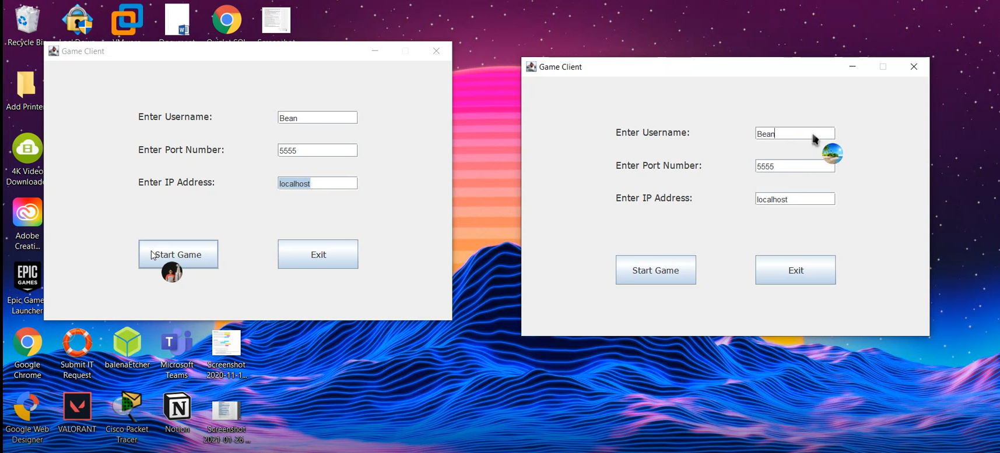
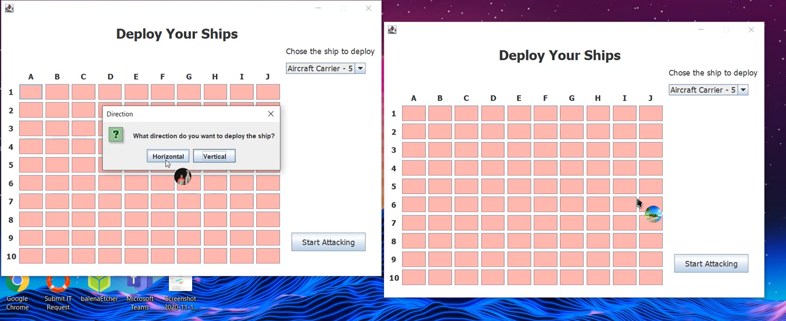
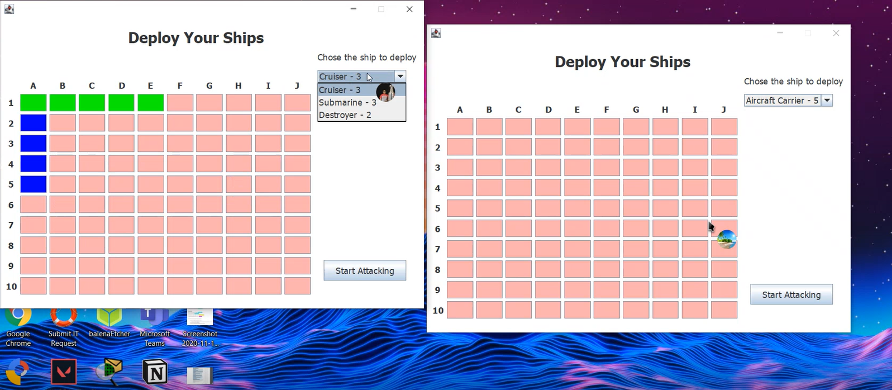
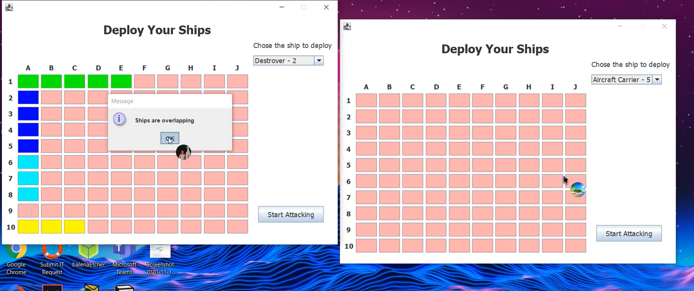
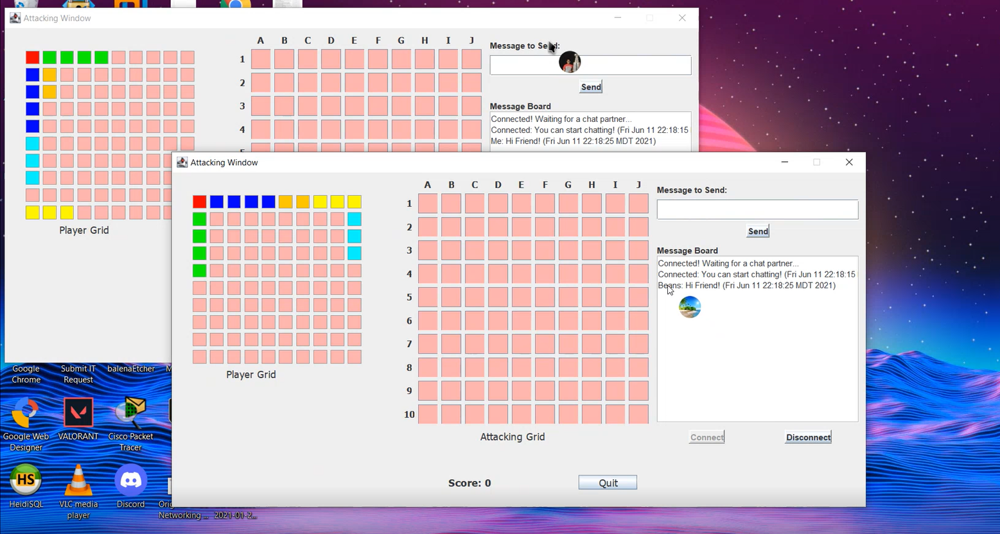
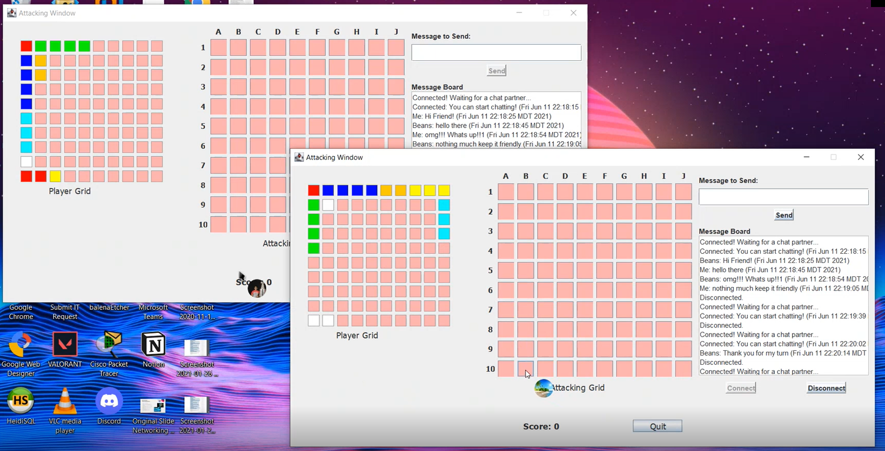

<h1>Project Screenshot</h1>

<h1>Project Description</h1>
This is a java multithreaded socket program of the Battleship game implemented with a server and game client.
Both the client and the server must have a GUI interface. 
The server’s GUI will be used to display and monitor game traffic; the client’s GUI will contain a fleet map, a target map, and any other components required to play the game
and chat during gameplay.
